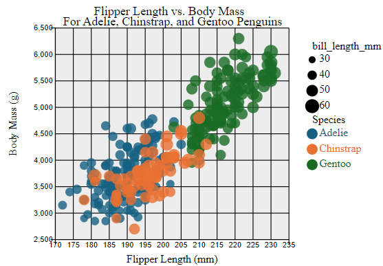

# Assignment 2 - Data Visualization, 7 Ways  
CS573, Spring 2024

Prof. Lane Harrison

Andrew Kerekon

## Tools
- ggplot2
- Excel
- d3
- Vega-Altair
- p5
- Flourish
- DataWrapper

## Libraries
- R
- JavaScript
- Python

# R + ggplot2

# Excel

Excel is a dedicated tool for graphing, and is widely used in the professional world.

To visualize the Penglings dataset, I utilized Excel's bubble chart feature to incorporate our three variables (flipper length, body mass, and bill length) across all three species (Adelie, Chinstrap, Gentoo). I expected this would be straightforward, as Excel is effectively a "little language" built for this purpose, but the process presented some surprising hiccups.

For one, I first had to clean the data of unnecessary columns (island, bill depth, sex, and year) as well as invalid (NA) entries before Excel would allow points to be plotted. I then had to splice our y and "bubble size" columns (body mass and bill length) to separate columns underneath the three species to treat them as separate series. Once this was complete, factors such as adding labels to the chart were not straightforward, nor was changing the size of the bubbles to reflect bill length. I scaled bubble size to 25% and scaled them by width, rather than by area, to make the change more dramatic. I also rounded each bill length to the nearest 10 to provide better differentiation between bubbles, and changed transparency of each bubble to 20% which was opposite my initial intuition (default appeared that 0% was fully visible, and 100% fully transparent).

After all of these changes, Excel didn't appear to have the capacity to add legend labels for species nor a legend for the bill length bubble size, so I was not able to add these portions. Despite these setbacks, I could see this tool being useful for non-technical users to create effective visualizations without needing to program them manually.

Resources Consulted:
- https://www.statology.org/excel-bubble-chart-color-by-value/
- https://excelkid.com/bubble-chart/

# JavaScript + d3

d3 is a tool designed specifically for creating interactive visualizations with the JavaScript language.

To visualize the penglings dataset, I used promises to import data from CSV and filtered out any entry such that bill_length_mm was "NA". Ithen used d3's built in axes to create x and y axes of a particular size, translating as needed to allow labels to end in the right locations. I also used tickSizeInner to ensure grid lines would display. Following resources below, I created points for each data point at 80% opacity that mapped each species to a different color, with flipper_length_mm along the x-axis and body_mass_g on the y-axis. By iterating over all possible bill_length_mms, I rounded to the nearest 10 to choose the right bubble size and created a corresponding legend with both species mapped to color and bill_length mapped to circle size.

It was easy to bring in data, but difficult to adjust/scale where data ended up. I found myself having to test manual offsets for axis labels, which I needed to add myself rather than have tied to an axis like in Excel. I also found certain method chainings and general overhead of SVG files to be particularly cumbersome, especially when text would not appear until I set the fill to black. I would recommend d3 for technical users who want powerful visualizations, but only if they have the time required to realize a fully-fledged graphic.

Resources Consulted:
- https://d3-graph-gallery.com/graph/scatter_grouped_highlight.html
- https://d3js.org/d3-fetch#csv
- https://d3js.org/d3-axis
- https://d3-graph-gallery.com/graph/custom_legend.html
- https://observablehq.com/@weitinglin/how-can-i-skip-an-element-of-an-array-when-i-perform-a-data-data-

# Python + Vega-Altair

# JavaScript + p5

# Flourish

# DataWrapper 

## Technical Achievements
- 

## Design Achievements
- 
